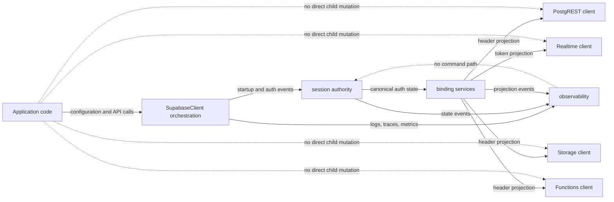

# Authority Model

Reference note describing who owns lifecycle, auth state, binding projection, and observability responsibilities inside the SDK.

## Authority Diagram

## Canonical Owners

- `SupabaseClient` owns orchestration lifecycle.
- `session authority` owns canonical auth/session state.
- `binding services` own projection of canonical auth state into child clients.
- child clients execute requests using projected state but do not define canonical session truth.
- observability owns evidence only: logs, traces, metrics, diagnostics.

## Rules

- Application code may configure, call public APIs, and initiate auth-affecting operations.
- Only the session authority may accept and publish canonical auth-state transitions.
- Only binding services may translate canonical auth state into child-client headers or access tokens.
- Child clients may consume projected auth state but may not redefine canonical auth state.
- Observability may inspect and emit evidence but may not mutate lifecycle or auth state.

## Forbidden Shortcuts

- no application-to-child direct header or token mutation path
- no child-client-owned canonical session state
- no observability callback acting as a hidden command path
- no auth-aware subsystem bypassing the session authority
- no late-starting binding missing current auth state because replay is absent

## Canonical Invariant References

- `INV-AM-001` — canonical auth/session state has one authority owner
- `INV-AM-002` — child clients consume projected state but do not define canonical truth
- `INV-OB-001` — observability has no command path into lifecycle or auth mutation

## Decision Test

When in doubt, ask:

1. Who requested this transition?
2. Who is allowed to decide canonical state?
3. Who is allowed to project that state into child clients?
4. Who can later prove what happened without gaining write authority?

If one component answers all four, the orchestration boundary has collapsed.
